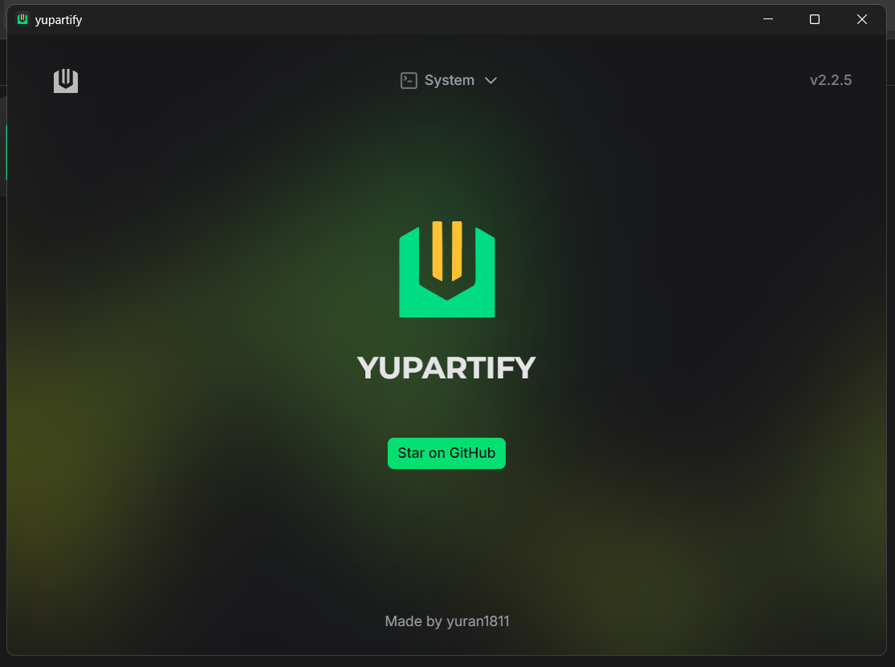
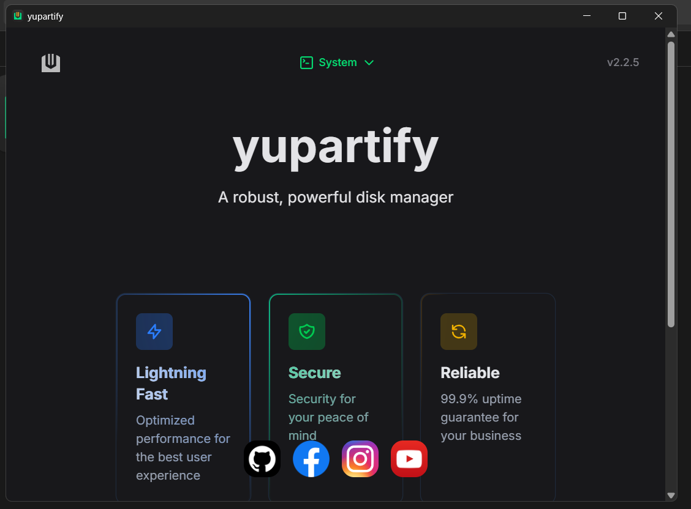
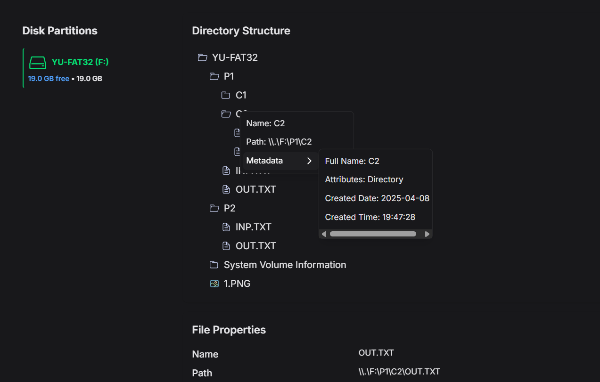
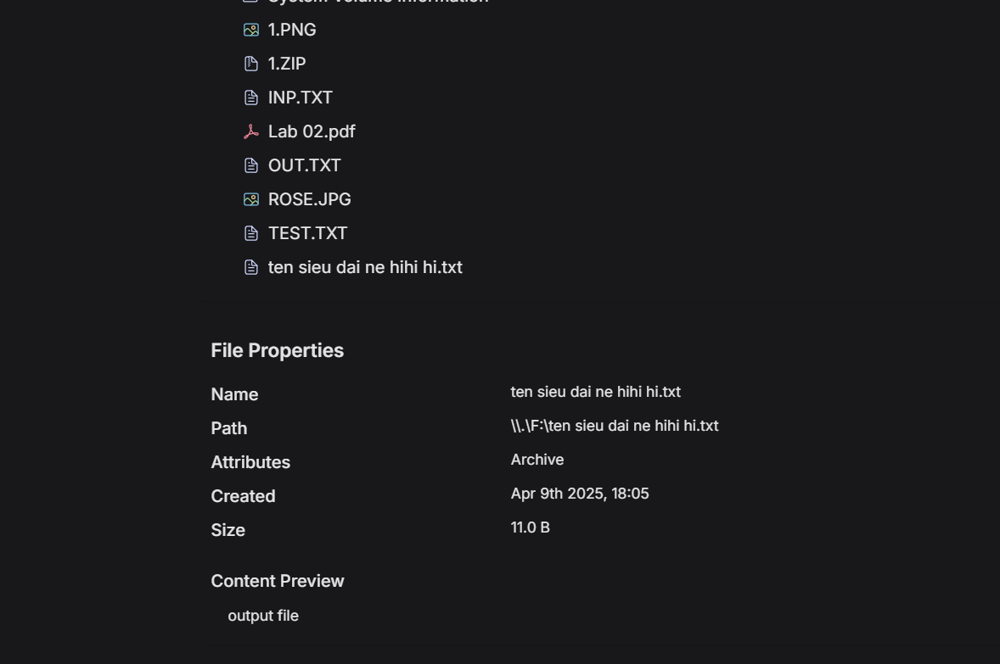
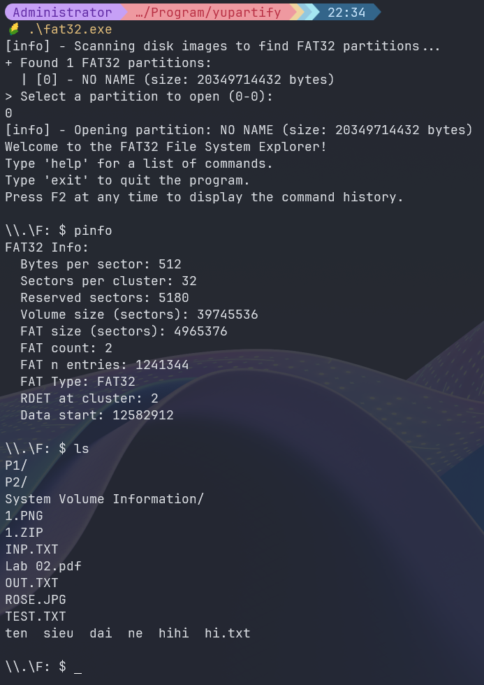

<h1 align="center">FAT32 Explorer</h1>
<p align="center" style="font-size:16px"><strong>A robust, powerful FAT32 explorer with the power of Tauri (Rust + Nuxt)</strong></p>
<p align="center">
  
</p>

<p align="center">
  
  
  
  
  
</p>

<div align="center"><a href="https://github.com/yuran1811/hcmus-os--fat32/releases" target="_blank">Releases</a></div>

## Tech Stack


## Screenshots

<div style="display:flex;gap:12px;justify-content:center">
  
  
</div>
<div style="display:flex;gap:12px;justify-content:center">
  
  
</div>
<div style="display:flex;gap:12px;justify-content:center">
  
</div>

## Quick Start

Follow these steps to set up the project locally on your machine.

**Prerequisites**

Make sure you have the following installed or downloaded on your machine:

- [Git](https://git-scm.com/)
- [Node.js](https://nodejs.org/en)
- [Rust](https://www.rust-lang.org/tools/install)

**Cloning the Repository**

```bash
git clone https://github.com/yuran1811/hcmus-os--fat32.git
cd hcmus-os--fat32
```

**Installation**

Install the project dependencies:

```bash
npm install
```

or

```bash
pnpm install
```

**Running the Project**

```bash
npm run tauri:dev
```

or

```bash
pnpm tauri:dev
```
